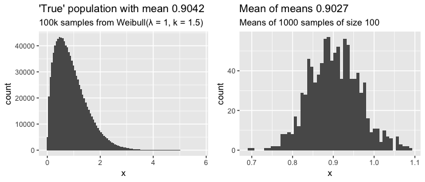
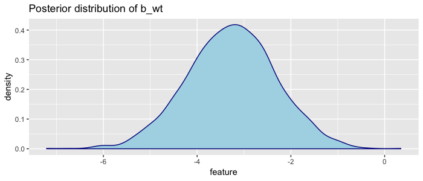
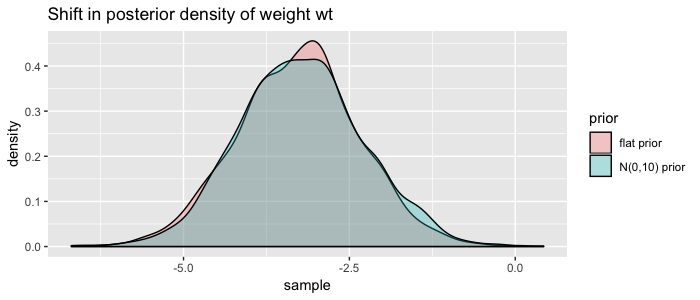
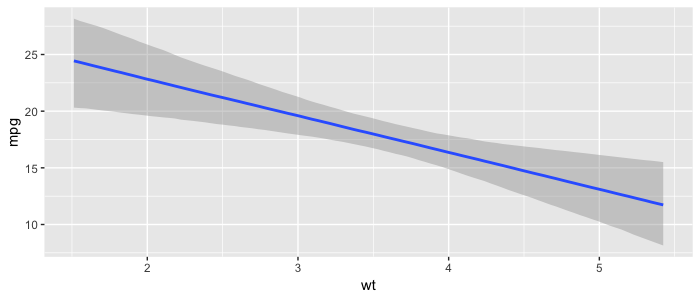

# From Central Limit Theorem to Bayes's Theorem via Linear Regression

Take any statistics course and you'll have heard about the central limit theorem. And you might have read about Bayes' theorem offering a different, more probabilistic method. In this long post I'll show how they are related, explaining concepts such as linear regression along the way. I'll use math, history, code, examples and plots to show you why both theorems are still very relevant for modern data scientists. 

<!-- more -->

We'll cover:

- [Central Limit Theorem](#central-limit-theorem)
- [CLT in A/B Testing](#clt-in-ab-testing)
- [Linear Regression](#linear-regression)
- [Using CLT to calculate uncertainty](#using-clt-to-calculate-uncertainty)
- [Bayes' Theorem](#bayes-theorem)
- [Bayesian Linear Regression](#bayesian-linear-regression)
- [Discussion](#discussion)

## Central Limit Theorem

It's hard to understate the importance of this theorem for modern science. It was only discovered in 1733 by the French Abraham de Moivre, then forgotten en rescued again by Pierre-Simon Laplace in 1812. But the real importance was only discerned in 1901 by Aleksandr Lyapunov. Now it is considered the unofficial sovereign of probability theory ([source](https://en.wikipedia.org/wiki/Central_limit_theorem#History)).

The Central Limit Theorem (CLT) states that if your population size is big enough (at least more than 30), the means of $n$ random samples of your population will be normally distributed *regardless* of the underlying distribution of your population. Let's skip the math and the jargon and just try this out in R:

```r
library(tidyverse)
library(ggplot2)
library(gridExtra)
set.seed(1337)

population <- rweibull(10e5, shape = 1.5, scale = 1)

generate_sample_means <- function(population, sample_size, n_samples) {
  rerun(n_samples,
        population %>% sample(sample_size) %>% mean) %>%
    unlist
}
sample_means <- population %>%
  generate_sample_means(sample_size = 100, n_samples = 1000)

p1 <- tibble(x = population) %>%
  ggplot(aes(x = x)) + geom_histogram(bins = 100) +
  ggtitle(glue::glue("'True' population with mean {round(mean(population),4)}"),
          subtitle = glue::glue("100k samples from Weibull(λ = 1, k = 1.5)"))
p2 <- tibble(x = sample_means) %>%
  ggplot(aes(x = x)) + geom_histogram(bins = 50) +
  ggtitle(glue::glue("Mean of means {round(mean(sample_means), 4)}"),
          subtitle = glue::glue("Means of 1000 samples of size 100"))
grid.arrange(p1, p2, nrow = 1)
```



Here we assume we know the entire true population of 100.000 values that have a clearly skewed [weibull](https://en.wikipedia.org/wiki/Weibull_distribution) distribution (left plot).
If we sample 100 values, record the average, and repeat 1000 times, we can start to see that distribution of sampled means looks like a [normal distribution](https://en.wikipedia.org/wiki/Normal_distribution) (right plot), with the mean of those sampled means approaching the actual mean of our population. Still confused? Check out this [interactive visualization](http://mfviz.com/central-limit/) of the central limit theorem.

This is already quite cool, but it gets more interesting when you see what happens when you increase the size of your (1000) samples:

```r
tibble(sample_size = c(50,100,500,1000)) %>%
  mutate(sample_means = map(sample_size, generate_sample_means, 1000)) %>%
  unnest %>%
  ggplot(aes(x = sample_means)) +
  geom_histogram(bins = 100) +
  coord_cartesian(xlim = c(.6, 1.2)) +
  facet_wrap(~ sample_size, nrow = 1, scales = "free_y")
```


So as you increase your sample size, your sampled means will be *closer* to the the true mean of our population (in this case 0.9042). And because the sampled means are normally distributed, you can actually estimate from a sample what the expected distance is between the sampled mean and the true population mean. This is called the estimated [standard error](https://en.wikipedia.org/wiki/Standard_error) ($SE$) and calculated as:

$$
\sigma_{\overline{x}}=\frac{s}{\sqrt{N}}
$$

$$
s=\sqrt{\frac{1}{N-1} \sum_{i=1}^{N}\left(x_{i}-\overline{x}\right)^{2}}
$$

- $\sigma_{\overline{x}}$ = (estimated) standard error of mean
- $s$ = sample standard deviation
- $N$ = sample size
- $x_{i}$ = sample element $i$
- $\overline{x}$ = sample mean

So if your estimated standard error is 0.1, this means that on average you expect your sample mean to be off by 0.1 to the true population average. As you can see in both the plot and the formula: the bigger your sample size, the lower your standard error. You can use the CLT and this standard error do all sorts of cool things. Let's start with a classic use-case: A/B Testing.

## CLT in A/B Testing

Let's say we have a landing page and we've measured that 1.0 % of our visitors click our 'buy' button (Scenario A). This is the mean of many visitors not clicking (zeros) en a couple that do click (ones). Now we build a new and improved landing page (our B scenario), and show this to 200 randomly selected visitors instead, and the click rate (conversion) is now 1.2%. But does that mean our new landing page is actually better, or we just got lucky?

We can use the CLT to find out how likely it is to find a sample mean of 1.2% given our 'null hypothesis' of mean 1%. Remember that for normal distributions, 95% of the values are within two standard deviations (= standard errors) of the mean $\mu$:

$$
\mu \pm 2 \cdot \operatorname{SE}\left(\mu\right)
$$


You might know this as the *95% confidence interval*. We need to be more precise however: exactly how many standard deviations (aka standard errors) is our sample mean
(1.2 %) away from our population mean (1 %)? This is called the *z-score* (a.k.a. [standard score](https://en.wikipedia.org/wiki/Standard_score)) and is given by:

$$
z=(x-\mu) / \sigma
$$

- $z$ = z-score (standard score)
- $x$ = Mean of experiment
- $\mu$ = Mean of population
- $\sigma$ = Standard error of population (or estimated SE from sample)

As you can see from the formula and the graph below (from wikipedia), the z-score is a nice normalized metric to say how far away our sampled mean is from the population mean.


Let's calculate the z-score for our A/B test. In this case we know of the 'true' population (our A scenario), so we do not have to estimate the standard error $\sigma$ from a sample but can calculate it from the logs. So let's say we measured that 1% of visitor click buy, with a 0.15% standard deviation. So $\mu$ = 1% and $x$ is 1.2%, so the z-score is (0.012 - 0.01) / 0.0015 = 1.333. This means we now know that our new landing page has an average conversion that is 1.333 standard deviations away from our normal landing page. But how probable is that? Again, because our means are normally distributed, we need to know how much of the distribution is on or past our z-score; i.e. we need to know the area under the curve paste the z-score; i.e. we need to know the probability $P$ that a value from distribution $Z$ is equal to more than our z-score $z$. This probability is called the *p-value*, and can be seen in the graph below. ([source](https://faculty.elgin.edu/dkernler/statistics/ch10/10-2.html))


It's hard to compute the p-value by hand because we need to integrate to find the area under the curve. We could look up pre-computed values (f.e. see this [z-score table](http://www.z-table.com/)), but it's easiest to compute using R:

```r
# Calculate p-value from z-score
pnorm(abs(1.33333), lower.tail = F)
#> 0.09121177
```

So we now know that there is a probability of ~9% that we find a conversion rate of 1.2% given a measurement of 200 visits to our old landing page. In order words; there is a 9% chance that our new landing page did not improve conversion but we were just lucky with our sample. In fact, it could even be that new landing page is *worse* than the current! So when do you decide that your new landing page is better than the old one? Often a p-value of 0.05 (5%) or even 0.01 (1%) is used, but ultimately, it's up to you determine the threshold. Often it's said that a p-value below 0.05 means something is *'significant'*, but this threshold makes no sense and you should carefully think about it yourself.. can you afford to be wrong?

So we've learned you can use the central limit theorem to do A/B testing. You simply measure or assume a mean for A and then do an experiment that gives you a sample B from which you can calculate its standard error. You assume B is not different from A (your *null hypothesis*), and will only accept that B is different (reject your null hypothesis) if the probability of measuring the mean you have for B is very low (*p-value* below f.e. 5%).

Want to go deeper?

- Build some intuition around p-values using this [short explanation with puppies](https://hackernoon.com/explaining-p-values-with-puppies-af63d68005d0).
- p-values are very common in the scientific community but there is a [lot](https://lucklab.ucdavis.edu/blog/2018/4/19/why-i-lost-faith-in-p-values) [of](https://www.vox.com/science-and-health/2017/7/31/16021654/p-values-statistical-significance-redefine-0005) [critique](https://www.sciencedirect.com/science/article/pii/S1063458412007789). TLDR; it can happen that your null hypothesis is not true or off, which means your false positive rate can be completely off.
- You can also turn this math around and determine up front the experiment (sample) size you need to make certain conclusions. If you expect your new landing page to lead to 5% more conversion, and you want to be very very sure it is (1% chance you're wrong), you would need X visitors (see [math details](https://www.ncbi.nlm.nih.gov/books/NBK43321/)).

Next, let's look at how the CLT is also used in another very common machine learning algorithm, linear regression.

## Linear regression

The earliest form of linear regression was published by Legendre in 1805 ([source](https://en.wikipedia.org/wiki/Regression_analysis#History)). Now it is often the first algorithm data scientists are taught when they learn about machine learning. This old algorithm is even present in our modern deep learning algorithms: a fully connected feedforward neural net with linear activation functions and several layers will in essence simply perform linear regression ([source](https://stats.stackexchange.com/questions/253337/what-is-the-difference-between-regular-linear-regression-and-deep-learning-lin)).

In machine learning, we assume we can predict a vector $Y$ with some feature matrix $X$ plus some random errors $\epsilon$:

$$
Y = f ( X ) + \epsilon
$$

In (multivariate) linear regression, we assume $f$ can be modelled with $n$ independent features that can be added together ([additive assumption](https://educationalresearchtechniques.com/2017/11/13/additive-assumption-and-multiple-regression/)) and an intercept $\beta _ { 0 }$:

$$
Y = \beta _ { 0 } + \beta _ { 1 } X _ { 1 } + ... + \beta _ { n } X _ { n } + \epsilon
$$

Simple right, except how do you find the $\beta$ values? Well if you make [several assumptions](https://statisticsbyjim.com/regression/ols-linear-regression-assumptions/) such as that the error $\epsilon$ has mean zero, the [Gauss-Markov Theorem](https://en.wikipedia.org/wiki/Gauss%E2%80%93Markov_theorem) states that the so-called Best Linear Unbiased Estimator (BLUE) is [Ordinary Least Squares](https://en.wikipedia.org/wiki/Ordinary_least_squares). This means you can find the best values for $\beta$ if you minimize the sum of the squared differences between your predictions $\hat{y}$ and actuals $Y$. This is called the residual sum of squares $RSS$:

$$
\mathrm{RSS}=\sum_{i=1}^{n}\left(y_{i}-\hat{y}_{i}\right)^{2}
$$

There are two basic methods to find the values for $\beta$ that minimise $RSS$. The first is a closed form mathemical solution called the normal equation ([proof](https://eli.thegreenplace.net/2014/derivation-of-the-normal-equation-for-linear-regression/)) that is surprisingly simple:

$$
\widehat { \beta } = \left( X ^ { \prime } X \right) ^ { - 1 } X ^ { \prime } y
$$

Neat, but as $X$ gets bigger (more features and/or observations) it becomes [computationally expensive](https://www.quora.com/What-does-it-mean-if-something-is-computationally-expensive). An alternative is using optimization algorithms, of which [gradient descent](https://towardsdatascience.com/linear-regression-using-gradient-descent-97a6c8700931) based algorithms are very popular in machine learning. These types of algorithms are typically much faster and can also be used for other types of models where no closed form solutions exist.

#### Toy problem

Let's try this out on the famous [mtcars](https://stat.ethz.ch/R-manual/R-devel/library/datasets/html/mtcars.html) dataset, which holds various characteristics for 32 cars. Let's try to predict the miles per gallon (`mpg`) of a car given it's weight (`wt`), horsepower (`hp`), quarter mile acceleration time (`qsec`) and whether or not the transmission is manual (`am`).  We'll do this using the normal equation, using `t()` for transpose and `%*%` for matrix multiplication:

```r
X <- mtcars %>%
   select(wt, hp, qsec, am) %>%
   mutate(intercept = 1) %>%
   as.matrix
Y <- as.matrix(mtcars$mpg)

beta <- matlib::inv(t(X) %*% X) %*% (t(X) %*% Y)
custom_model <- tibble(feature = c("wt","hp","qsec","am", "intercept"),
  coefficients = as.numeric(beta))
custom_model
#>   A tibble: 5 x 2
#>   feature   coefficients
#>   <chr>                <dbl>
#> 1 wt                 -3.24  
#> 2 hp                 -0.0174
#> 3 qsec                0.810
#> 4 am                  2.93  
#> 5 intercept          17.4   
```

Note the little trick where I've added the intercept as a feature with value 1. This way we can estimate all coefficients in one go.

## Using CLT to calculate uncertainty

So we've calculated (estimated) our coefficients, but remember our sample size (number of rows) was only 32. How likely is it that these estimates are actually true? The central limit theorem can be used here: it holds for our multivariate situation where we are estimating multiple coefficients. The key assumption here is that our 32 cars are a sample from a much larger population of cars (which makes sense). So our estimated coefficients are part of a [sampling distribution](https://en.wikipedia.org/wiki/Sampling_distribution), and if we could average the estimates obtained over a huge number of data sets (of size 32), then the average of these estimates would be spot on.

Our estimated variance $\hat{\sigma}$ (standard error) is given by:

$$
\hat{\sigma}^{2}=\frac{1}{N-p-1} \sum_{i=1}^{N}\left(y_{i}-\hat{y}_{i}\right)^{2}
$$

Note from the formula that the standard error will be smaller when the sample size $N$ increases. So in R we can calculate:

```r
y_hat <- X %*% beta

rss <- sum((y - y_hat)^2)
degrees_of_freedom <- (nrow(mtcars) - 4 - 1)
RSE <- sqrt(rss / degrees_of_freedom) # Residual standard error
RSE
#> 2.435098
```

Using that we can now for a particular coefficient $j$ calculate the $z$-score (from [ESL p.48](http://web.stanford.edu/~hastie/ElemStatLearn/)):

$$
z_{j}=\frac{\hat{\beta}_{j} - 0}{\hat{\sigma} \sqrt{v}_{j}}
$$

where $v_{j}$ is the $j$th diagonal element of $\left(\mathbf{X}^{T} \mathbf{X}\right)^{-1}$ (the intuition here is that the more variability we have in the explanatory variable, the more accurately we can estimate the unknown coefficient [see SO post](https://stats.stackexchange.com/questions/267948/intuitive-explanation-of-the-xtx-1-term-in-the-variance-of-least-square)). Note I've added the minus zero in the formula for clarify; our null hypothesis is that the true coefficient is zero (the feature does not influence our target).

Using the $z$-score, we can again calculate the $p$-values. Note that we want a two sided hypothesis test: our null hypothesis is that the coefficient is zero, but it could in fact be positive of negative.

```r
matrixinv <- matlib::inv(t(X) %*% X)
diagonals <- diag(matrixinv)
zscores <- beta / (RSE * sqrt(diagonals))
custom_model <- custom_model %>%
  mutate(z_score = as.numeric(zscores),
         p_value = 2 * pnorm(abs(z_score), lower.tail = F))
custom_model
#> feature   coefficients z_score  p_value
#> <chr>            <dbl>   <dbl>    <dbl>
#> 1 wt             -3.24     -3.64 0.000274
#> 2 hp             -0.0174   -1.23 0.219   
#> 3 qsec            0.810     1.85 0.0649  
#> 4 am              2.93      2.09 0.0363  
#> 5 intercept      17.4       1.87 0.0613
```

We now have uncertainty estimates, and can see that there is a 21.9% chance that we found the current coefficient for horsepower `hp` (-0.0174) while it was actually zero (no influence on miles per gallon at all). We could use that information and build a new, simpler model without the `hp` feature.

We've built a linear regression model from scratch and calculated uncertainty using the central limit theorem. Cool! Now let's check our math with the base R implementation. In R it's actually a one-liner using `lm()`, which is much much faster, and actually uses both C and fortran under hood ([here’s a deepdive](http://madrury.github.io/jekyll/update/statistics/2016/07/20/lm-in-R.html)).

```r
lm_model <- lm(mpg ~ wt + hp + qsec + factor(am), data = mtcars)
summary(lm_model)
#> Coefficients:
#>             Estimate Std. Error t value Pr(>|t|)   
#> (Intercept) 17.44019    9.31887   1.871  0.07215 .
#> wt          -3.23810    0.88990  -3.639  0.00114 **
#> hp          -0.01765    0.01415  -1.247  0.22309   
#> qsec         0.81060    0.43887   1.847  0.07573 .
#> factor(am)1  2.92550    1.39715   2.094  0.04579 *
#> ---
#> Signif. codes:  0 ‘***’ 0.001 ‘**’ 0.01 ‘*’ 0.05 ‘.’ 0.1 ‘ ’ 1

#> Residual standard error: 2.435 on 27 degrees of freedom
#> Multiple R-squared:  0.8579,	Adjusted R-squared:  0.8368
#> F-statistic: 40.74 on 4 and 27 DF,  p-value: 0.00000000004589
```

Some observations:

- Our estimates are *almost* the same, but there are some small differences due to rounding errors (also note `tibble` does not show all digits when printing)
- Our $p$-values are *roughly* the same. This is because for linear regression the normal distribution is replaced by the [$t$-distribution](https://stattrek.com/probability-distributions/t-distribution.aspx). This distribution asymptotically approaches normal as the sample size increases, and is almost similar after $N$ > 30 (our sample size $N$ was 32).

#### Downside linear regression

We've seen that concepts from CLT are very important in linear regression (LR). Linear regression is awesome because it's simple, super fast to calculate and the results are easily interpretable by humans (maybe with the exception of $p$-values). But there are some downsides:

- LR assumes our observed $Y$ values are actually sampled from a larger, true population of $Y$. In our sample toy case with cars this could be true, but this is not always the case.
- Often building LR models involves an iterative process of removing non-significant features and adding new ones. You can do this in many different ways, going forward (adding features) or backward (removing them), but there is no best way. Two data scientists could end up with two different but valid models using the same data.
- LR returns point estimates of our coefficients, which by itself tells us nothing about the uncertainty in its accuracy.   

We could in fact alleviate some of these concerns and build a model on our `mtcars` dataset while dropping CLT all together.

## Bayes' Theorem

This Theorem has some interesting history. It was actually independently discovered and popularized by Pierre-Simon Laplace, who also rediscovered the central limit theorem! The theorem has been invented multiple times, the earliest record being that of a reverend called Thomas Bayes somewhere in the 1740s. Bayes's Theorem has been used to crack the enigma code, estimate the mass of Jupiter, and discover that slightly more human baby boys are born than baby girls. Today it is widely used but it was quite controversial for a long time. If you want to read more on the history see the blogpost [A History of Bayes' Theorem](https://www.lesswrong.com/posts/RTt59BtFLqQbsSiqd/a-history-of-bayes-theorem) or read the book: [The Theory that would not die](https://www.amazon.com/Theory-That-Would-Not-Die/dp/0300169698/).

What is the big idea? Basically we formulate what we already know (called our *initial belief*, *prior* or *event A*), and then when we see new data (*event B*), we update what we know (*believe*) accordingly (now called our *posterior*). The famous Bayesian equation is thus:

$$
P(A | B)=\frac{P(B | A) P(A)}{P(B)}
$$

Here we are expressing 'events' occuring using *conditional probability*: the probability that an event will happen given that another event took place. So Bayes Theorem in words reads: "the probability of A given that B have occurred is calculated as the unconditioned probability of A occurring multiplied by the probability of B occurring if A happened, divided by the unconditioned probability of B." ([source](https://towardsdatascience.com/linear-and-bayesian-modelling-in-r-predicting-movie-popularity-6c8ef0a44184))

You can also put this another way:

- $P(B \mid A)$ is the probability of data given your hypothesis, and is called the likelihood.
- $P(A)$ is the probability of your hypothesis, and is called the prior
- $P(B)$ is the probability of the data under any hypothesis, and is called the normalizing constant
- $P(A \mid B)$ is the probability of your hypothesis after seeing the data, called the posterior

The normalizing constant $P(B)$ is not often something we're interested in, and if we drop it we can still maintain proportionality. Which is why Bayes' theorem also often reads:

$$
P(A | B)\propto P(B | A) P(A)
$$

or in words:

$$
\text { posterior } \propto \text { likelihood } \times \text { prior }
$$

## Bayesian linear regression

In order to do [bayesian linear regression](https://en.wikipedia.org/wiki/Bayesian_linear_regression) on our `mtcars` dataset we need to create a statistical model with a likelihood function. We can do that by rewriting our original linear regression model (defined earlier in this post) as a probabilistic model:

$$
\begin{aligned} y_{i} & \sim \mathcal{N}\left(\mu_{i}, \sigma\right) \\ \mu_{i} &=\alpha+\beta X_{i} \end{aligned}
$$

So the miles per gallon `mpg` of a single car $y_{i}$ can be modelled using a normal distribution $\mathcal{N}$ parametrized by mean $u_{i}$. which is a linear function of $X$ parametrized by intercept $\alpha$, coefficients $\beta$ and standard deviation $\sigma$ ([see this SO post](https://stats.stackexchange.com/a/252608)). Remember we will have as many coeffients $\beta$ as we have features (columns) in our dataset $X$.

Now to find the optimal values of these parameters we will use [maximum likelihood estimation](https://stats.stackexchange.com/questions/112451/maximum-likelihood-estimation-mle-in-layman-terms). Interestingly this is the same as estimating these values using Ordinary Least Squares estimation (see notes [Andrew Ng, cs229](http://cs229.stanford.edu/notes/cs229-notes1.pdf)).

So we now have a statistical model to find the $\text { likelihood }$ of our parameters: $p(y \mid \alpha,\beta,\sigma)$. We are interested in the $\text {posterior}$ distribution of our parameters: $p(\alpha,\beta,\sigma \mid y )$. We still need to define our $\text { prior }$: $p(\alpha,\beta,\sigma)$. Again, Bayes' formula:

$$
\text { posterior } \propto \text { likelihood } \times \text { prior }\\
p(\alpha,\beta,\sigma \mid y) \propto p(y \mid \alpha,\beta,\sigma) p(\alpha,\beta,\sigma)
$$

The priors also need to be defined as distributions. Here you need to carefully consider encode what you know as a distribution. As an example, for gas milage I know that recent cars have a `mpg` between 10 and 40 ([source](https://www.cars.com/articles/best-and-worst-gas-mileage-2018-1420698621218/)). Our model probably won't be able to explain everything, so my prior for the intercept $\alpha$ will be a normal distribution with mean 25 and standard deviation 15: $N(25,15)$. We need to set priors for every coefficient in $\beta$ and the standard deviation $\sigma$ of our probabilistic model as well.

What do you do if you have no clue on how to set your priors? I don't like cars enough to be an expert. We can say that we have no clue by using very uninformative priors (also known as [flat](https://www.quora.com/What-is-a-flat-prior-in-the-Bayesian-method) or [diffuse](https://en.wikipedia.org/wiki/Prior_probability) priors). An example would be a very wide uniform distribution like $U(-10^{99},10^{99})$.

Note that when we use very uninformative priors the influence of the likelihood (from the data) will be large, because $\text{prior} \propto 1$. In bayesian linear regression this means the maximum likelihood of our posterior distributions of the parameters will yield the same result as the ordinary least squares method we used earlier. However, when we use very informative priors (a distribution with a high spike in a small numeric range), we will need a lot of data in order to make significant changes to our estimated parameters. In other words, the [prior starts to lose weight when we add more data](https://stats.stackexchange.com/questions/200982/do-bayesian-priors-become-irrelevant-with-large-sample-size/201059#201059).

#### Calculating the posterior distribution

From the bayesian formula you can see that we are multiplying probability distributions $likelihood * prior$. This calculation is easier if both distributions are from the same [probability distribution family](https://en.wikipedia.org/wiki/List_of_probability_distributions), otherwise "there may be no analytical solution for the posterior distribution" [source](https://en.wikipedia.org/wiki/Bayesian_linear_regression). In our case we have a statistical model with a normally distributed likelihood, so we would be wise to define a [conjugate prior](https://en.wikipedia.org/wiki/Conjugate_prior): a prior that is also normally distributed. The prior and posterior are then called conjugate distributions, and the posterior can then be [derived analyically](https://en.wikipedia.org/wiki/Bayesian_linear_regression).

After calculating the posterior, we are left with the joint distributions of our parameters: $p(\alpha, \beta, \sigma \mid y)$. In order to find the marginal distributions $p(\alpha \mid y)$, $p(\sigma \mid y)$ and each of $p(\beta \mid y)$, we would have to solve a whole set of integrals. Instead, to find those marginal distributions sampling algorithms are used, where each parameter is sampled conditional on the other parameters. Most popular are [Markov Chain Monte Carlo](https://en.wikipedia.org/wiki/Markov_chain_Monte_Carlo) techniques such as [Gibbs Sampling](https://en.wikipedia.org/wiki/Gibbs_sampling), [Metropolis–Hastings Sampling](https://en.wikipedia.org/wiki/Metropolis%E2%80%93Hastings_algorithm) and more recently [No U-Turns Sampling](https://stats.stackexchange.com/questions/311813/can-somebody-explain-to-me-nuts-in-english) (NUTS).

Luckily there are many [packages for bayesian inference](https://cran.r-project.org/web/views/Bayesian.html) in R to help us. I recommend `brms` because it is well documented and plays well with other packages. Using python? Have a look at [pymc3](https://docs.pymc.io/) or the new [TensorFlow probability](https://www.tensorflow.org/probability) library.

#### Applying bayesian linear regression

After all that theory, fitting a bayesian linear regression model in `brms` on our `mtcars` dataset is actually quite simple:

```r
library(brms)
custom_mtcars <- mtcars %>% mutate(am = factor(am))
fit <- brm(mpg ~ wt + hp + qsec + am,
           data = custom_mtcars, family = gaussian(), chains = 2)
fixef(fit)
#>             Estimate  Est.Error         Q2.5       Q97.5
#> Intercept 17.5712388 9.78331475 -1.545673562 36.30109293
#> wt        -3.2376061 0.97190016 -5.230973286 -1.34308464
#> hp        -0.0176161 0.01517784 -0.046647580  0.01238611
#> qsec       0.8023787 0.46047930 -0.132152623  1.69762655
#> am1        2.9189454 1.50775195  0.002281527  6.04845493
```

Notice that the estimates are very very similar to our earlier OLS estimation. This is because `brms` uses "an improper flat prior over the reals" (see `vignette("brms_overview")`) by default. Because we used very uninformative priors what we see is basically the estimate the maximum likelihood of a probability distribution, which is the same als the OLS estimation. We can see the distributions by plotting the samples from the posterior marginal densities. `brms` offers plotting functionality, but let's extract the samples and do it manually:

```r
# Get MCMC Samples for each parameter
samples <- fit %>%
  brms::as.mcmc() %>%
  as.matrix() %>%
  as_tibble()
```

By default `brms` takes 2000 samples. We can then use [Kernel Density Estimation](https://mathisonian.github.io/kde/) (KDE) to create a smooth curve to visualize the density. The `ggplot` has KDE built in with the `geom_density()` geom. Let's visualize the distribution of the estimates for weight `wt`:

```r
# Visualize
plot_distribution <- function(data, feature_name) {
  data %>%
    pull(feature_name) %>%
    tibble(feature = .) %>%
    ggplot(aes(x=feature))+
    geom_density(color="darkblue", fill="lightblue") +
    geom_point(aes(y = feature)) +
    ggtitle(glue::glue("Posterior distribution of {feature_name}"))
}
samples %>% plot_distribution("b_wt")
```



Here we can visually see that the most likely value of weight is ~ -3, but also that given the `mtcars` dataset, we are very confident the coefficient is between -6 and 0. This plot is made so often that it is built in: `brms::plot(fit)`.

But we can do better. I don't know much about cars but I can be a bit more specific on the priors:

```r
priors <- c(
  set_prior("normal(25, 15)", class = "Intercept"),
  set_prior("normal(0, 10)", class = "b", coef = "wt"),
  set_prior("normal(0, 10)", class = "b", coef = "hp"),
  set_prior("normal(0, 10)", class = "b", coef = "qsec"),
  set_prior("normal(0, 10)", class = "b", coef = "am1")
)
```

```r
fit2 <- brm(mpg ~ wt + hp + qsec + am,
           data = custom_mtcars,
           prior = priors,
           family = gaussian(), chains = 2)
fixef(fit2)
#>           Estimate  Est.Error        Q2.5       Q97.5
#> Intercept 17.40913139 9.96990040 -3.01219958 37.57619153
#> wt        -3.20417139 0.94568225 -4.98073192 -1.29575873
#> hp        -0.01801657 0.01461242 -0.04755709  0.01124505
#> qsec       0.80701586 0.46487332 -0.12740591  1.74774618
#> am1        2.97567564 1.51970719 -0.01908289  5.92563120
```

So we specified the priors as distributions, and `brms` multiplied them with our likelihood distribution in order to update our posterior distributions. We can visualize the shift of using our more informative priors by plotting the marginal distribution of `weight` again:

```r
tibble(
  "flat prior" = samples$b_wt,
  "N(0,10) prior" = samples_fit2$b_wt
) %>%
  tidyr::gather(prior, sample) %>%
  ggplot(aes(x=sample)) +
  geom_density(aes(fill=prior), alpha = .3) +
  ggtitle("Shift in posterior density of weight wt")
```



Not much of a shift, but you get the point ;) Do more research to define better priors!

One of the upsides of having distributions instead of exact estimates for our coeffients is that we can build many visualizations showing our uncertainties in estimations and predictions. The `bmrs` package has a lot built in, and the [tidybayes](http://mjskay.github.io/tidybayes/) offers many more. As an example, here is a plot of how weight `wt` influence the miles per gallon `mpg`, including our 95% uncertainty interval:

```r
plot(marginal_effects(fit2, effects = "wt"))
```



Finally, it can be hard to define good priors. It [is recommend](https://github.com/stan-dev/stan/wiki/Prior-Choice-Recommendations) to scale predictors and outcomes in order to make it easier to define priors. Selecting the feature set can also be challenging. In our non-bayesian LR we explained features selection can be done by adding or dropping non-significant features (features that are likely to be zero) using forward- or backward selection. In the bayesian world there are other techniques you can explore for this, such as [bayesian model averaging](https://www.coursera.org/lecture/bayesian/bayesian-model-averaging-adz4Y).

## Discussion

We've come a long way and seen how the central limit theorem and Bayes' theorem relate. There has a been a lot of discussion historically about which is the better approach ([frequentists vs bayesians](https://xkcd.com/1132/)). Interestingly we've seen both theorems were invented by the same man: mathematician Pierre LaPlace. Both theorems have their uses, and their up and downsides.

Downsides Central Limit Theorem:

- Assumes your data is a sample from some much bigger population. This puts a lot of pressure on your dataset, in terms of size and how random your sample was. It assumes there are enough measurements to say something meaningful about $\beta$.
- We often use the 5% significance level to state that some hypothesis is 'true'. But this would also imply that by chance 5% of our scientific research is wrong!
- The $p$-values and significance tests rely on 'imaginary repetitions' ([Harold Jeffreys](https://en.wikipedia.org/wiki/Harold_Jeffreys))

Bayes's Theorem also has downsides:

- Defining priors is very subjective as every scientist can define different priors for the same data. Critics say it is "ignorance coined into science" while CLT can be used for everything. However [Frank Ramsey](https://en.wikipedia.org/wiki/Frank_P._Ramsey) says as more data comes in scientists will tend to agree more (because the influence of priors will become smaller).
- You really have to put thought into your priors
- Calculating $\text{likelihood} * \text{prior}$ is slow. MCMC Sampling requires a lot of computation.
- MCMC Sampling does not always converge.

I believe bayesian models can really help for certain types of problems, especially because it offers you a way to encode your domain knowledge. In the end we still don't know for sure exactly how our features influence the milage in cars, but we've learned techniques to communicate and visualize our estimates and their uncertainty.

Hope you've learned something new. [Let me know](../../about.md) if you have any feedback!

If you're interested: [code for this blogpost](https://gitlab.com/snippets/1855201)
